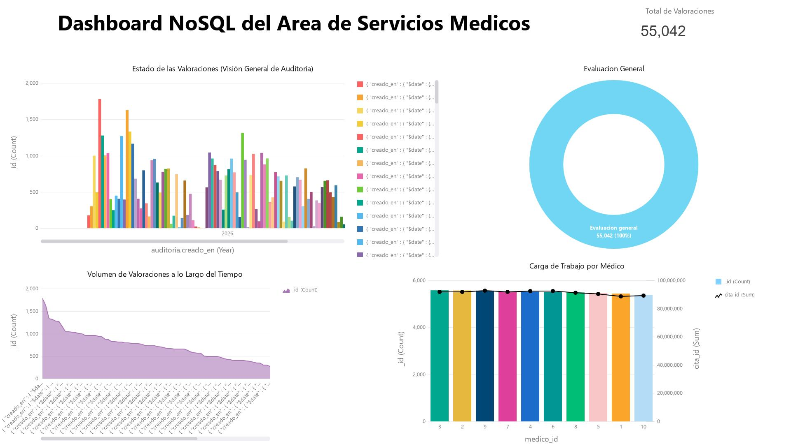
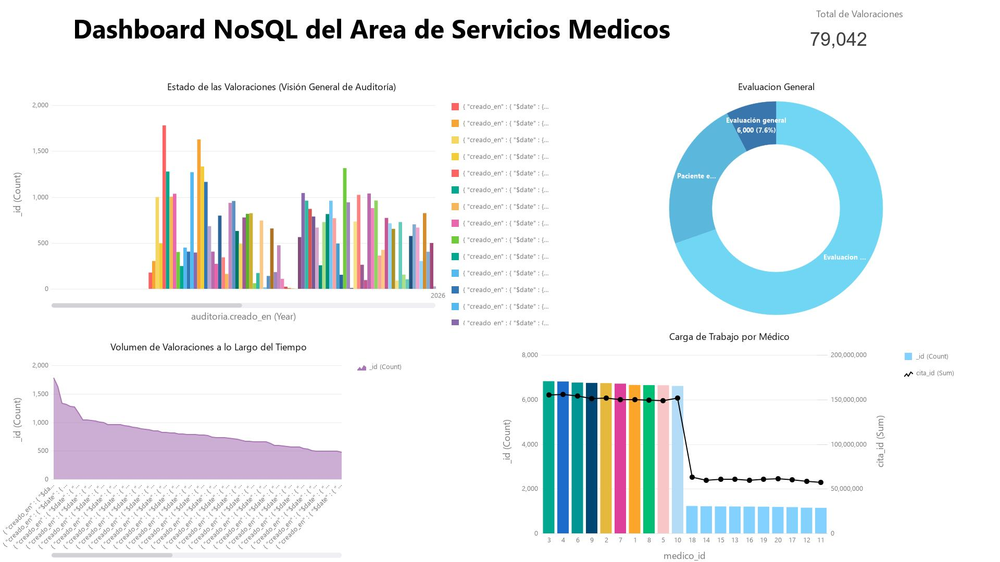

# Dashboard – Visualización de Datos


## Descripción

Esta carpeta contiene los **dashboards de visualización de datos** para la API de Servicios Médicos.

Su propósito es:

* Mostrar métricas generadas en las pruebas
*  Comparar el rendimiento entre SQL y NoSQL
* Analizar datos clínicos simulados
* Facilitar la interpretación de resultados

## Estructura

```bash id="dash1"
dashboard/
│── Dashboard_NoSQL.nbi
│── Dashboard_NoSQL.jpg
│── Upgrade_Dashboard_NoSQL.jpg
```

## Dashboard NoSQL (MongoDB)

### Versión inicial



### Versión mejorada



## Tecnologías utilizadas

| Componente          | Tecnología                                                                                                            |
| ------------------- | --------------------------------------------------------------------------------------------------------------------- |
| Base de datos SQL   | MySQL         |
| Base de datos NoSQL | MongoDB     |
| Visualización       | Dashboards (.nbi)              |
| Análisis            | Comparativa de rendimiento  |
|

## Objetivo del Dashboard

* Comparar eficiencia entre bases de datos
* Evaluar tiempos de respuesta
* Analizar volumen de datos generados
* Identificar diferencias entre SQL y NoSQL

## Notas

* Los archivos `.nbi` corresponden a configuraciones de dashboards
* Las imágenes `.jpg` representan resultados visuales exportados
* Se incluyen versiones mejoradas para análisis comparativo

### Autores

1. **Jose Francisco Flores Amador** /[@JFFA25](https://github.com/JFFA25)
2. **Edgar Cabrera Velázquez** /[@Edgar-Cbr](https://github.com/Edgar-Cbr)
3. **Edwin Hernández Campos** /[@Edwinhdzcm](https://github.com/Edwinhdzcm)
4. **Giovany Raul Pazos Cruz** /[@giova0412](https://github.com/giova0412)
5. **Uriel Maldonado Bernabe** /[@Urii7895](https://github.com/Urii7895)