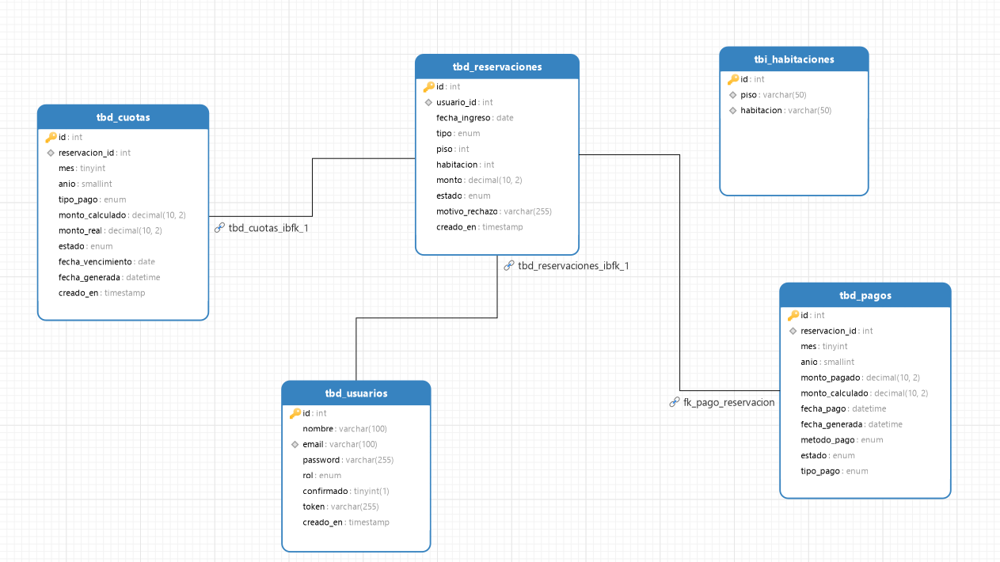

# Estructura de Datos (SICPES)

## Descripción

En este apartado se encuentra la **Arquitectura de Datos (ERD)** correspondiente a la base de datos **SICPES**.

El **Entity Relationship Diagram (ERD)** permite visualizar la estructura de las tablas, así como las relaciones entre las entidades principales utilizadas para gestionar reservaciones, infraestructura y finanzas dentro del sistema integrado de la residencia médica/física.

Esta arquitectura sirve como referencia para:

* Desarrollo de la base de datos
* Comprensión de las relaciones lógicas entre reservaciones y pagos
* Implementación de consultas y validaciones en los controladores
* Mantenimiento, migraciones y escalabilidad del sistema

## Diagrama de Relaciones

## Arquitectura de Datos (ERD)

| Entidad                  | Descripción                                                                            |
| ------------------------ | -------------------------------------------------------------------------------------- |
| **tbd_usuarios**         | Entidad principal que almacena el acceso central (login), rol y datos personales básicos |
| **tbi_habitaciones**     | Catálogo que administra la estructura e inventario físico de las habitaciones en sus respectivos pisos |
| **tbd_reservaciones**    | Controla el ciclo de vida (desde solicitud hasta rechazo) y vincula un usuario a un espacio físico |
| **tbd_cuotas**           | Programación de vencimientos financieros futuros esperados (mensualidades, cuotas extra, etc) |
| **tbd_pagos**            | Registro transaccional que valida los cobros efectivos derivados de una reservación   |

## Relación entre Entidades

La arquitectura de SICPES sigue un modelo interconectado seguro donde:

1. **tbd_usuarios** funciona como la raíz primaria (una persona).
2. Cada persona genera **tbd_reservaciones** para adquirir control parcial sobre la ocupación del catálogo de **tbi_habitaciones**.
3. El historial financiero se controla derivando de las reservaciones: proyectando deudas mediante **tbd_cuotas** y saldándolas a través de **tbd_pagos**.

Este modelo permite **separar los individuos, la ocupación hotelera y el modelo económico**, logrando un alto nivel de normalización para analíticas de datos.
